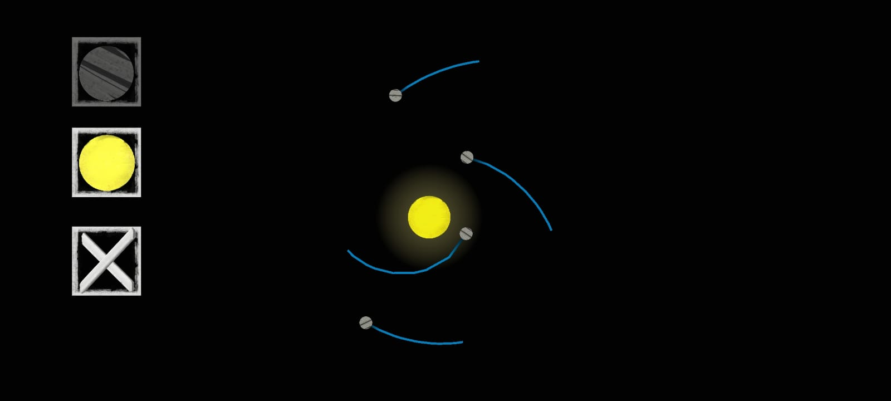

# Gravitation2D

Gravity is a fundamental force that governs the movement of celestial objects in the universe.

This is a 2D gravity simulator for desktop and mobile developed using Unity, which allows users to observe and interact with the effects of gravity on objects in a virtual space. The simulation is based on the universal law of gravitation formulated by Isaac Newton, which states that every object in the universe attracts every other object with a force that is directly proportional to the product of their masses and inversely proportional to the square of the distance between them.

In this simulator, users can interact by adding two objects, stars, which have fixed positions and relatively large masses, and small moons, which will be influenced by the gravity of the stars around them.

Through this project, I gained a deeper understanding of the mechanics of gravity and developed my skills in Unity development. I hope that this simulator can be used as an educational tool for students and enthusiasts who, like me, enjoy learning more about how our universe works.

